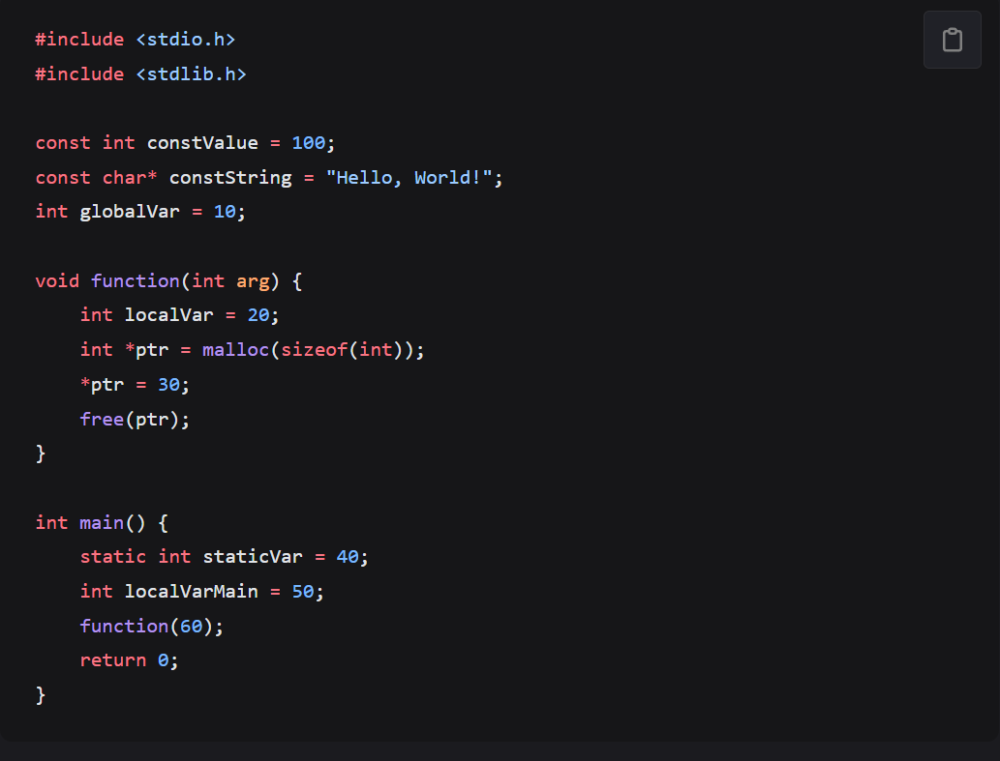

# CS-EASY-03 内存模型
## c语言内存模型

#### 程序代码区：
即保存程序代码的内存，我们所写的程序语言编译为机器语言后存储其中
常量区：保存const限制后变量的内存例如const int i，还有字符串、数字等常量存放在常量区。
#### 全局数据区：
存放全局变量的内存，分为data段和bss段；data段已经初始化，而bss段未被初始化例如int i;在bss段而int i=1;在data段。
#### 堆区：
堆区由程序员分配内存和释放。堆区按内存地址由低到高方向生长，其大小由系统内存上限决定，速度较慢，但自由性大，可用空间大。
分配内存可用malloc函数，释放用free函数。
#### 动态链接库：
较为书面的定义是一个可以被其它应用程序共享的程序模块，我的理解是，将多个程序的内存相连，使在一个程序中可以调用其他程序的函数和数据等。
#### 栈区
栈区由编译器自动分配释放，由操作系统自动管理，无须手动管理。
栈区上的内容只在函数范围内存在，当函数运行结束，这些内容也会自动被销毁。
栈区按内存地址由高到低方向生长，其最大大小由编译时确定，速度快，但自由性差，最大空间不大。
栈区遵循先进后出原则

### 1.什么是“栈溢出”？
即栈内空间不足以容纳要储存的数据，可以形象的比作“溢出”
### 2.堆区和栈区的区别是什么？
区别1：内存地址，堆是从低到高生长，而栈是从高到低生长
区别2：内存分配释放上，堆区由程序员分配内存和释放，而栈由编译器自动分配释放
区别3：速度上，由于堆区的内存很大，想要访问寻找数据，速度自然相对较慢；而一般栈区内存小，寻找数据速度自然较快。个人认为访问速度上的差距其实本质上是内存大小的差距。
### 3.程序运行过程中，内存模型当中的哪些区是只读的，哪些区是可读写的？
只读：代码区
读写：栈区，堆区，数据区
### 4.如何使用malloc()、free()函数，它们针对的哪一个区进行操作？
###### malloc函数有如下原型void*malloc(size_t size)其中size可以用sizeof()来精确分配所需内存大小，malloc函数可以进行强制转换例如int *p=(int*)malloc(sizeof(int))，将int类型内存转换为int*类型；
##### free函数原型为void free(void*ptr),其中参数为malloc函数calloc函数和remalloc函数分配内存后的指针，作用为将指针内存释放(有借有还太合理辣，用malloc函数借内存，用free函数还内存)
free函数和malloc函数都是对堆区操作
几点注意事项：
1.malloc分配的内存不会自动初始化即有内存但内存中无内容
2.free函数不能不是动态分配的内存或者已经释放过的内存会，否则会导致未定义行为
3.使用free函数时应注意要应该确保没有其他指针指向这块内存，否则可能会导致悬空指针问题(个人觉得可以理解为其他指针在如此操作后指向null而因此无意义)
### 5.为什么要对程序使用的内存进行管理？
1.提高内存的利用，避免浪费，个人认为，当程序较小时这一点不是特别突出，而当制作大型程序时，所需要的内存增多，如果不进行内存的管理，内存浪费的影响就会被放大，而内存意味着成本，也就意味着程序开发的成本增大。
2.提高程序运行的速度，我们知道，在不同的内存区中，数据访问的速度有较大差别，对于需要频繁访问的数据和偶尔访问的数据进行内存区的合理分配，可以提高速度。
3.防止出现内存错误，不合理分配内存可能会导致指针悬空缓冲区溢出等问题进而导致程序崩溃还有可能导致数据损坏。
# 内存模型的应用
对内存模型的更好认识，有助于我们在调度数据、优化程序运行效率等方面更加得心应手。小强在学习完内存模型的知识后，兴致勃勃地写出了如下程序

小强想知道以下变量或对象的存储区域，请你协助小强完成他的答案，并解释为什么某些变量存储在特定的内存区域：

#### constValue
常量区，该变量为const修饰的int类型应为常量区，虽然此变量在main函数外，但并不属于全局区（我一开始也疑惑），但考虑到常量不能被改变，而储存在全局区有被改变的风险，因此将该变量储存在常量区
#### constString
常量区和constValue一样在常量区，原理同上
#### globalVar
全局区，该变量在main函数和其他函数外定义，明显是全局区
#### staticVar
全局区，该变量由static修饰，在全局区中的静态区
#### localVar
栈区，该变量于function函数内，为局部变量，在进行function函数中分配内存，在function函数结束后自动释放内存，个人认为要如此做的原因有2，其一，节约内存，
其二如果有需要的话，方便多次使用function函数，因为每次该变量在函数结束后可以自动释放内存，下一次再次使用该函数时，不会因为上一次变量进行过赋值而影响这一次的值。
#### ptr
栈区，理由同localVar
#### localVarMain
栈区，该变量为main函数中的一个整型变量，属于局部变量，存储于栈区中存取时速度快，因此将该变量储存在栈区。
# 浅谈Cache
### 1.什么是冯诺伊曼体系结构？什么是现代计算机的组织结构？这两者的不同点在哪里？
冯诺伊曼体系结构：
1.五大结构：运算器，控制器，存储器，输入设备，输出设备
2.三大原则：二进制，程序储存，顺序执行
现代计算机结构：
中央处理器（cpu），存储器，输入设备输出设备，总线

区别：
其一，现代计算机结构将运算器和控制器合并为中央处理器，我认为这样做的好处是，因为控制器要发出指令让运算器工作，自然要传输大量数据和指令，分开的运算器和控制器要相互传输数据需要时间，数据量很大时，就会造成延迟，合并之后延迟减小速度提高。
其二：现代计算机结构加了总线（即主板），其作用很好理解，把计算机各个部分链接起来，高效的数据流通。系统扩展的基础，连接外部设备如打印机等。
其三：冯诺伊曼结构以运算器为中心，就会导致运算器承担更多的工作。计算机从以运算器为中心转变为以存储器为中心，这一步从我对市场的了解看，稍微懂一点电子设备的都知道，买手机电脑主要是看cpu性能的，可见，cpu是计算机中很宝贵的资源，相应的，其造价也是最高的。所以为了不浪费cpu资源，就将计算机的中心从运算器转变到了存储器。
### 2.主存储器是如何工作的？
对于主存储器，我觉得用手机的运行内存来理解更为形象，当计算机运行时，主存储器从存储（辅存）中读取数据，并将最近使用的程序放入主存储器中，我们在电子设备上能看到的也就是后台，要保持下次启动应用时还停留于上一次退出的页面就需要把数据放在主存中。至于程序运行时的数据处理，自然是主存传给cpu来做。

关于较为书面的解释：主存储器工作分为读操作和写操作
存储器的读操作是将存储单元中的数据传输到CPU中。读操作的过程如下：
- CPU向存储器控制器发送读命令，同时提供要读取的存储单元的地址。
- 存储器控制器接收到读命令后，根据地址找到对应的存储单元。
- 存储器控制器将存储单元中的数据通过总线传输到CPU中。
- CPU接收到数据后进行进一步处理。
2. 写操作
存储器的写操作是将数据从CPU传输到存储单元中。写操作的过程如下：
- CPU向存储器控制器发送写命令，同时提供要写入的存储单元的地址和数据。
- 存储器控制器接收到写命令后，根据地址找到对应的存储单元。
- 存储器控制器将CPU提供的数据通过总线写入到存储单元中。
用一个较为形象的箭头图概括
cpu<->主存<->辅存
### 3.什么是Cache的局部性原理，它包括哪些方面的内容
局部性原理是指
程序在执行过程中呈现出的对存储器访问的局部性特点
1.时间局部性：如果一个存储单元被访问，那么在不久的将来它很可能再次被访问。
2。空间局部性：如果一个存储单元被访问，那么与它相邻的存储单元也很可能在不久的将来被访问。
以下为个人理解：
时间局部性：如果将一个存储单元看作一个应用，就像手机应用后台一样，你使用了应用例如qq，那么之后你可能又想打开qq聊天，以上比喻可能不太恰当，具体场景为在程序中表现为可能存在循环。
空间局部性：如果将一堆相邻的存储单元比作一个应用所需的存储空间，如果你要启动一个应用，但是先使用其中一个功能，那么这个应用的其他功能（即相邻的其他存储单元）也有可能被使用。程序中具体场景可以表现为数组。
### 4.Cache的运用为什么可以加快系统整体性能？
基于主存的读取速度和cpu的读取速度有巨大的差异，而Cache作为高速缓冲存储器，它会将主存中的一小部分数据存储起来，如果这部分数据刚好是cpu所需要的，则cpu就会直接从Cache中直接存取数据，从而减少cpu对主存的访问次数，一次加快了访问速度，当cpu要访问主存中的一个单元，我们就可以将这个单元复制到Cache中，这样就可以极大提高cpu对数据的访问的速度。